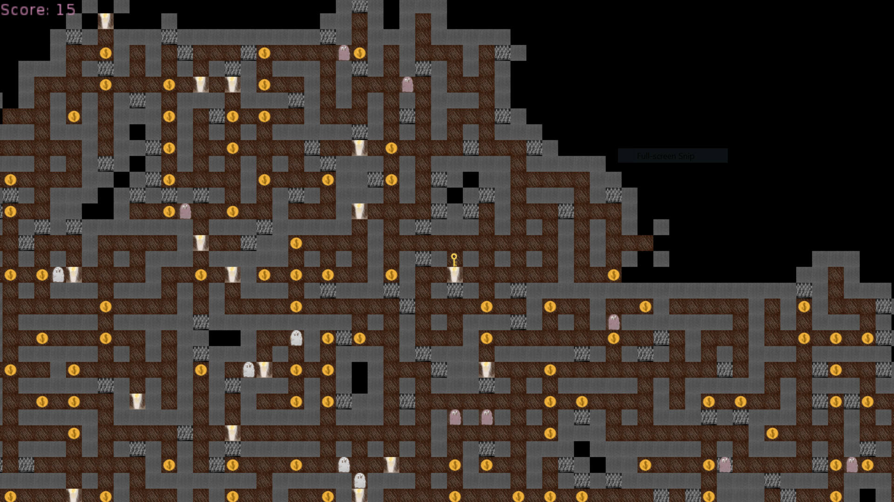

# lost

A maze exploring game.

## Gameplay
Avoid spikes and ghosts and collect coins.

Use TTS notifications with care.

## Controls

- w/a/s/d, arrow keys ## movement
- +/- ## zoom in/out
- q/esc ## exit the game
- ` ## open lua console

## Download
See https://github.com/slemonide/lost/releases

## Online version
Try it online at https://slemonide.github.io/lost/

## License
GPLv3 for everything besides the `lib` folder.

## Libraries used
https://github.com/rinqu-eu/love2d-console
https://github.com/tanema/light_world.lua